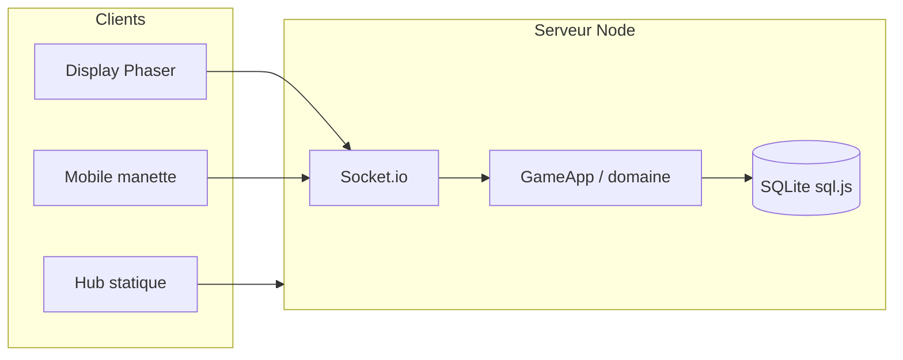

<div align="center">

<h1>Zero Strike</h1>

**Jeu de tir tactique multijoueur sur LAN** — jusqu’à **40 joueurs** : un **grand écran** (Phaser) et des **smartphones** comme manettes.

[](https://nodejs.org/)
[](.github/workflows/ci.yml)
[](#crédits--licence)

</div>

---

## Sommaire

- [Pourquoi ce projet](#pourquoi-ce-projet)
- [Démarrage rapide](#démarrage-rapide)
- [Fonctionnalités](#fonctionnalités)
- [Stack technique](#stack-technique)
- [Architecture](#architecture)
- [Installation complète](#installation-complète)
- [Développement](#développement)
- [Configuration](#configuration)
- [API & classement](#api--classement)
- [Tests & CI](#tests--ci)
- [Déploiement](#déploiement)
- [Documentation](#documentation)
- [Crédits & licence](#crédits--licence)

---

## Pourquoi ce projet

Zero Strike est pensé pour une **salle de cours**, une **LAN party** ou une **soutenance** : un serveur Node autoritaire, des clients web (display + mobile), et une expérience **spectacle** sur vidéoprojecteur. Le code met l’accent sur **réseau**, **temps réel** (Socket.io), **séparation des responsabilités** (MVC / couches domaine–app–infra) et **durcissement** documenté ([`AUDIT_TECHNIQUE.md`](AUDIT_TECHNIQUE.md)).

---

## Démarrage rapide

```bash
git clone https://github.com/<votre-org>/ZeroStrike.git
cd ZeroStrike
npm install
npm run build
npm start
```

| URL | Rôle |
|-----|------|
| `http://localhost:3000/` | **Hub** — choix grand écran ou manette |
| `http://localhost:3000/display` | Affichage seul |
| `http://localhost:3000/mobile` | Manette seule |
| `http://localhost:3000/health` | Santé du service (ex. Render) |

Sur le **même Wi‑Fi**, les joueurs utilisent l’**adresse IP du PC** à la place de `localhost` (voir [`INSTALL.md`](INSTALL.md)).

**Optionnel :** copier [`.env.example`](.env.example) vers `.env` et renseigner les variables nécessaires (ex. `GIPHY_API_KEY` pour les GIF du kill feed sur le display).

---

## Fonctionnalités

- **Multijoueur LAN** — jusqu’à **40** joueurs ; serveur **autoritaire** (~60 TPS), physique et état de partie côté serveur.
- **Hub** — page `/` : orientation **grand écran** ou **manette** ; liens directs `/display`, `/mobile`.
- **Lobby** — hôte, paramètres, **vote de carte**, QR vers le hub, audio / affichage.
- **Modes** — **Search & Destroy** (bombe, économie) et **Deathmatch** ; presets Fun / Compétitif / Démo BUT / Perso.
- **Mobile** — joystick (Nipple.js) et actions ; sync avec la partie en cours.
- **Classement** — **SQLite** embarqué (`sql.js`), API REST + affichage in-game.
- **Effets display** — kill feed, killstreaks, option **Giphy** (GIFs) si clé configurée.

---

## Stack technique

| Zone | Technologies |
|------|----------------|
| Serveur | **Node.js 20+** (ESM), **Express**, **Socket.io** v4, **sql.js** |
| Display | **Phaser 3**, **Vite** |
| Mobile | HTML5, **Nipple.js**, Vite |
| Qualité | Tests Node natifs, **Playwright** (e2e), GitHub Actions |
| Ops | **Docker Compose**, blueprint **Render** (`render.yaml`) |

---

## Architecture



- **Display** et **Mobile** se connectent au même serveur ; la logique métier vit dans `server/domain/` et `server/app/`.
- Les cartes sont des **grilles ASCII** (`server/models/maps/`) ; pipeline **Tiled** documenté dans `docs/maps/`.
- Détail des dossiers : [MAINTENANCE.md — Fichiers de configuration et de jeu](MAINTENANCE.md#fichiers-de-configuration-et-de-jeu-mvc).

---

## Installation complète

1. **Node.js ≥ 20** et npm.
2. `npm install` puis `npm run build` (génère `client-display/dist/` et `client-mobile/dist/`).
3. `npm start` — écoute par défaut sur **0.0.0.0:3000**.

**Docker :** `docker-compose up --build` — détails dans [`INSTALL.md`](INSTALL.md).

**Dépannage** (port, pare-feu, téléphone qui ne joint pas le serveur) : même fichier.

---

## Développement

| Commande | Usage |
|----------|--------|
| `npm run dev` | Serveur avec `--watch` |
| `npm run dev:display` | Vite + hot reload (display) |
| `npm run dev:mobile` | Vite + hot reload (mobile) |
| `npm test` | Tests unitaires |
| `npm run test:coverage` | Tests + couverture |
| `npm run validate` | `npm test` + `npm run build` (comme une partie de la CI) |
| `npm run ci:local` | `validate` + tests e2e Playwright |
| `npm run tiled-to-ascii -- <map.json> -o grille.txt` | Export Tiled → ASCII 80×45 |

---

## Configuration

Fichier modèle : **[`.env.example`](.env.example)** — à copier en **`.env`** en local (déjà ignoré par Git).

| Variable | Rôle |
|----------|------|
| `PORT`, `HOST` | Port et interface d’écoute |
| `DB_PATH` | Fichier SQLite du classement (défaut `data/leaderboard.db`) |
| `ALLOWED_ORIGINS` | Origines CORS Socket.io (important en prod) |
| `DISPLAY_PASSWORD` | Protège le namespace display (recommandé en salle) |
| `GIPHY_API_KEY` | Optionnel — GIFs kill feed via proxy `/api/giphy/...` |
| `NODE_ENV`, `METRICS_TOKEN`, `TRUST_PROXY`, rate limits | Voir `.env.example` |

Ne **commitez jamais** de secrets ; en production, définissez les variables sur la plateforme (Render, etc.).

---

## API & classement

- **Santé :** `GET /health`
- **Classement :** `GET /api/leaderboard`, `GET /api/leaderboard/player/:name`, etc.
- **Proxys contrôlés :** `/api/giphy/:query`, `/api/randomuser` (clés et limites côté serveur).

Le projet **n’utilise pas MongoDB** — uniquement **SQLite** via sql.js.

---

## Tests & CI

- **Locale :** `npm run validate` puis éventuellement `npm run ci:local`.
- **CI :** [`.github/workflows/ci.yml`](.github/workflows/ci.yml) — tests, couverture, e2e, build avec artefact display.
- **Guide pas à pas :** [`docs/GUIDE_VALIDATION.md`](docs/GUIDE_VALIDATION.md).

---

## Déploiement

Cible documentée : **[Render](https://render.com)** — build `npm install && npm run build`, start `npm start`, health check `/health`, persistance SQLite via volume et **`DB_PATH`**.

Résumé des secrets et variables : section déploiement de [`docs/GUIDE_VALIDATION.md`](docs/GUIDE_VALIDATION.md) et [`render.yaml`](render.yaml).

**Hébergement gratuit (sleep) et campus :** sur l’offre gratuite, l’instance peut **se mettre en veille** après une période sans trafic ; le **premier chargement** ou la **première connexion Socket.io** peut alors prendre **jusqu’à environ une minute** (cold start). Ce n’est pas un bug du jeu : prévoir un essai « réveil » ou un plan toujours actif si vous faites une démo live. Sur **Eduroam** ou Wi‑Fi d’établissement, la qualité du lien (latence, pertes) varie : les clients parlent au **serveur HTTPS** Render, mais un réseau saturé peut quand même provoquer des déconnexions — en cas de doute, tester aussi en **4G**. Les logs serveur émettent une ligne JSON par déconnexion (`zs: "socket_disconnect"`) avec la **raison** Socket.io (`ping timeout`, `transport close`, etc.) pour corréler avec les retours joueurs.

---

## Documentation

| Document | Contenu |
|----------|---------|
| [`INSTALL.md`](INSTALL.md) | Installation, Docker, LAN, dépannage |
| [`MAINTENANCE.md`](MAINTENANCE.md) | Config, logs, gameplay, presets |
| [`AUDIT_TECHNIQUE.md`](AUDIT_TECHNIQUE.md) | Sécurité, réseau, bonnes pratiques |
| [`docs/GUIDE_VALIDATION.md`](docs/GUIDE_VALIDATION.md) | Validation locale, CI, LAN, Render |
| [`docs/maps/`](docs/maps/) | Tiled, livraison cartes, rendu debug |

---

## Aperçu visuel

<p align="center">
  
</p>

<p align="center"><em>Ajoutez une capture sous <code>docs/screenshots/lobby.png</code> pour l’afficher sur GitHub.</em></p>

---

## Crédits & licence

Projet réalisé dans un cadre **BUT Informatique** (parcours déploiement d’applications communicantes et sécurisées) — objectifs pédagogiques : **TCP/IP**, **WebSocket**, architecture **MVC** / clean, UX grand écran + mobile.

Les **assets tiers** (Kenney, etc.) restent soumis à leurs **licences** (`vendor/kenney/**/License.txt`).

Il n’y a **pas de fichier `LICENSE` à la racine** pour l’instant : ajoutez-en un (ex. MIT) si vous publiez en open source, ou respectez les règles de votre établissement pour un dépôt « projet étudiant ».

---

<div align="center">

**[⬆ Retour en haut](#zero-strike)**

</div>
