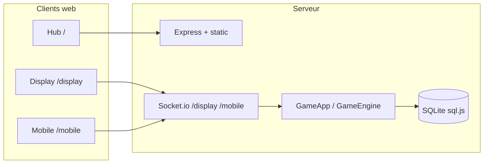

# Vue d’ensemble du projet

## Objectif

**Zero Strike** est un jeu de tir tactique **multijoueur sur LAN** (jusqu’à **40 joueurs**), pensé pour salle de cours, LAN party ou soutenance :

- un **serveur Node.js autoritaire** (~60 ticks/s) calcie physique, collisions, économie et fin de round ;
- un **grand écran** (navigateur + **Phaser 3**) affiche la carte et l’action ;
- des **smartphones** servent de **manettes** (joystick, visée, achats, vote carte).

La séparation des rôles évite la triche client : les clients envoient des **intentions** (mouvement, tir), le serveur valide et diffuse un **état** cohérent.

## Stack principale

| Couche | Technologie |
|--------|-------------|
| Serveur | Node **≥ 20** (ESM), **Express**, **Socket.io** v4 |
| Persistance classement | **sql.js** (SQLite en mémoire + fichier) |
| Display | **Phaser 3**, **Vite** |
| Mobile | HTML5, **Nipple.js**, Vite |
| Tests | Runner Node natif (`tests/*.test.js`), **Playwright** (`tests/e2e/`) |
| Conteneur / cloud | **Docker Compose**, blueprint **Render** (`render.yaml`) |

## Principes d’architecture

- **Serveur autoritaire** : vérité gameplay côté `server/domain/` et services associés.
- **Découpage type MVC** (côté serveur) : `controllers/` (HTTP + sockets), `services/` (boucle, orchestration), `domain/` (moteur), `models/`, `middleware/`, `infra/`, `database/`.
- **Domaine sans I/O** : le moteur renvoie des **effets déclaratifs** (`server/domain/effects.js`) ; `GameApp` les exécute (sockets, stats, timers).
- **Cartes** : monde logique **1920×1080 px** ; données issues de **fichiers Tiled** (`.tmj` sous `maps/`) avec **repli ASCII** (`server/models/maps/*GridBuilder.js`, `Maps.js`).

## Flux réseau simplifié

## Entrées utilisateur courantes

| URL / chemin | Rôle |
|--------------|------|
| `/` | Hub statique (`public/`) — choix display / mobile |
| `/display` | SPA Phaser buildée (`client-display/dist/`) |
| `/mobile` | SPA manette buildée (`client-mobile/dist/`) |
| `/health` | JSON santé (`{ ok, service }`) pour orchestrateurs |
| `/api/*` | REST classement + proxys (Giphy, randomuser) + métriques |

## Modes de jeu (rappel)

- **Search & Destroy (S&D)** : bombes, sites A/B/C, économie type tactique.
- **Deathmatch (DM)** : score par kills, limite configurable (`dmKillLimit`).

Les durées, argent de départ et options (power-ups, etc.) dépendent des **presets** (`shared/gamePresets.js`) et des réglages lobby (`update_settings`).

## Documents liés

- [Structure du dépôt](02-structure-depot.md)
- [README racine](../README.md) — badges, sommaire utilisateur
